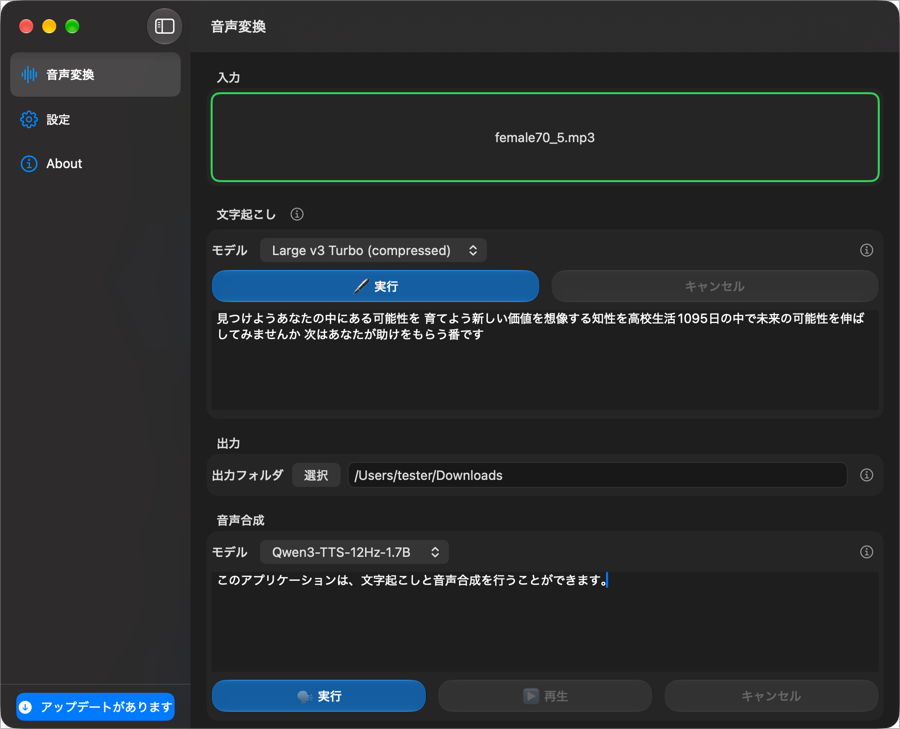

# 音声変換ツール

音声ファイルを文字起こしして、その結果を使って音声合成を行うアプリです。

## どんな処理を行うのか

1. 文字起こし
2. 音声合成

## 対象OS

| OS      | サポート   |
|---------|--------|
| macOS   | サポート済み |
| Windows | 未サポート  |
| Linux   | 未サポート  |

## 設定

### アプリケーション設定ファイル

- `~/.config/tree-voice-assistant/settings.json` に、アプリケーション設定ファイルが保存されます。
- アプリケーションが上記設定ファイルを作成・編集し、次回起動時にアプリケーションの設定を復元します。

### ユーザーが用意したサウンドファイルを配置する

- ユーザーサウンドファイルは、アプリケーションを再起動すると読み込まれます。

#### 成功時のサウンド

- `~/.config/tree-voice-assistant/sounds/success` に、ユーザーが用意したサウンドファイルを配置すると、アプリケーションで選択可能になります。

#### 失敗時のサウンド

- `~/.config/tree-voice-assistant/sounds/error` に、ユーザーが用意したサウンドファイルを配置すると、アプリケーションで選択可能になります。

### ユーザーが用意した背景画像を配置する

- ユーザー背景画像ファイルは、アプリケーションを再起動すると読み込まれます。
- `~/.config/tree-voice-assistant/wallpaper` に、ユーザーが用意した背景画像ファイルを配置すると、アプリケーションで選択可能になります。

## 免責事項・ご利用上の注意

本アプリは、音声の文字起こしおよび音声合成を行うためのツールです。

本アプリの利用にあたっては、利用者ご自身の責任において、入力する音声・テキスト・その他のデータ、および生成される音声の利用が、適用される法令、第三者の権利、利用規約その他の関係規定に適合していることをご確認ください。

音声、声の特徴、名称、その他の情報の取り扱いについては、素材の入手元、利用目的、利用方法等によって、第三者の権利または利益に関わる場合があります。必要な許諾、同意、その他の確認については、利用者ご自身で調査・判断してください。

本アプリの提供者は、個々の利用者による具体的な利用方法、特定の状況における適法性、権利処理の要否、第三者からの許諾の有無等について、個別の判断、法律相談、または保証を行いません。

本アプリの利用に関する法令、権利関係、利用規約その他の疑問については、利用者ご自身で関係法令・規約・公式資料等を確認し、必要に応じて弁護士その他の専門家へご相談ください。提供者は、個別の質問や相談に対する回答、調査、判断、助言等を行う義務を負うものではありません。

本アプリの利用に関連して第三者との間で問題が生じた場合、利用者ご自身の責任において対応するものとします。

本アプリおよびその関連情報は、現状有姿で提供されます。提供者は、本アプリの完全性、正確性、継続的な動作、特定目的への適合性等を保証しません。

本アプリの利用または利用不能により生じた損害については、法令上免責が認められない場合を除き、提供者は責任を負わないものとします。

本アプリに含まれる外部ライブラリ、音声認識モデル、音声合成モデル等については、それぞれのライセンスおよび利用条件が適用されます。利用者ご自身で各コンポーネントの利用条件をご確認ください。

本アプリを利用する場合、利用者は上記の注意事項を確認し、自身の判断と責任において利用するものとします。
