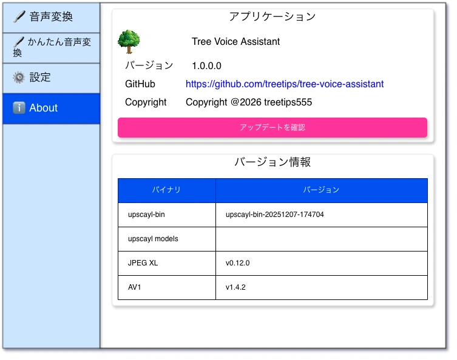

# About画面



## ✳️アプリケーション

- 表形式で表示します。

### ✏️ アプリケーション名

#### アプリアイコン

- アイコン `assets/images/icon-tree-01.png` を `縦50px（アスペクト比を維持）` で表示。

#### 静的ラベル

- 固定で `Tree Voice Assistant` と表示。

### ✏️ バージョン番号

#### 静的ラベル

- 固定で `バージョン` と表示。

#### 動的ラベル

- `1.0.0` の部分はアプリケーションのバージョン番号です。
- `Major` `Minor` `Patch` を使った [セマンティックバージョニング](https://semver.org/lang/ja/) を採用します。

#### バージョニング例

```
1.0.0 : 初期バージョン
1.0.1 : バグを修正した
1.1.0 : 機能強化を行った
1.1.1 : 機能強化のバグを修正した
2.0.0 : 互換性を保証できない大きな機能強化を行った
```

### ✏️ GitHub

#### 静的ラベル

- 固定で `GitHub` と表示。

#### 動的ラベル

- リンク形式（クリックでブラウザが開く）で `https://github.com/treetips/tree-voice-assistant` を表示します。

### ✏️ copyright

#### 静的ラベル

- 固定で `Copyright` と表示。

#### 静的ラベル

- 固定で `Copyright @2026 treetips555` と表示。

### ✏️ アップデートを確認

表の下（カード内）に表示します。

- [アプリのアップデート](./common.md) を参照。

## ✳️ バージョン情報

- 表形式で表示します。

### ✏️ argmax-oss-swift

#### 静的ラベル

- `argmax-oss-swift` という静的ラベルを表示します。

#### 動的ラベル

- 現在のバージョンを表示します。
- バージョン番号はFlutterの定数クラスで管理するので、そこから取得します。
