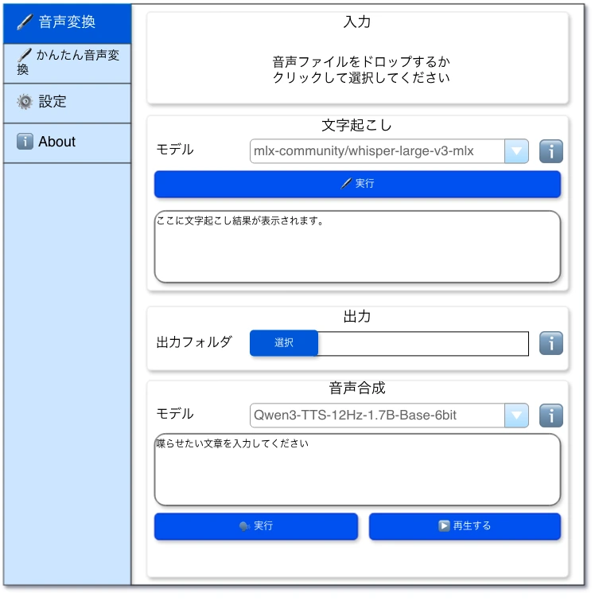

# 音声変換



## ✳️ 入力

### ✏️ 音声ファイルのドラッグドロップエリア

#### 音声ファイルのドラッグドロップエリアの静的ラベル

- ドロップエリアの上下中央寄せで以下を表示します。
  ```
  音声ファイルをドロップするか
  クリックして選択してください
  ```

#### 音声ファイルのドラッグドロップエリアのアクション

- エリアに音声ファイルをドラッグドロップするか、クリックしてファイルを選択します。
- 音声ファイル以外をドロップしても反応しません。
- エリアをホバーするとカーソルがポインターになります。
- 変換前に、エリアの枠を標準に戻します。
- 変換に `成功` した場合、エリアの枠を `緑色` にします。
- 変換に `失敗` した場合、エリアの枠を `赤色` にします。

#### 静的ラベル

- `対象フォルダ` という静的ラベルを表示します。

#### 選択ボタン

- `フォルダ` を選択させます。このフォルダに存在する画像ファイル一式が対象ファイルになります。

## ✳️ 文字起こし

- 見出し横のℹ️に品質向上のTIPS（音声の長さ・声の条件・手動修正）を表示します。

#### ℹ️

- ホバーするとpopoverに説明が表示される。
- 以下のテキストが記述されていること。
  ```
  💡 TIPS
  品質を上げるためには以下を試してみてください。
  * 5~15秒程度の音声にしてください。短過ぎても長過ぎても良い結果になりません。
  * 極力本人のみの声（BGM・ノイズ・他人の声が入らないようにする）にしてください。
  * 文字起こしの結果がおかしい場合は手動で修正してください。
  ```

### ✏️ モデル

#### 静的ラベル

- `モデル` という静的ラベルを表示します。

#### モデルプルダウン

- `Whisper` のモデルを選択します。
- 選択肢は以下の通りです。
  - Large v3 Turbo (compressed)
  - Large v3 Turbo
  - Base (multilingual)
  - Base (English-only)
  - Small (Multilingual)
  - Small (English-only)
  - Tiny (Multilingual)
  - Tiny (English-only)
- 初期値は `Large v3 Turbo (compressed)` です。

#### ℹ️

- ホバーするとpopoverに説明が表示される。
- 「Largeは高品質で処理が遅く、Tinyは低品質で高速です」というテキストが記述されていること。

### ✏️ 文字起こし実行

#### 静的ラベル

- `🖊️ 実行` という静的ラベルを表示します。

#### 実行ボタン

- 入力ファイルが正常入力されていない場合 `disabled` 、正常になったら `enabeld` に状態が変わります。
- クリックすると `ローディング` 表示に変わり、処理が終わるまでクリックできない（連続クリック防止）状態になります。
- 入力で選択された音声を元に文字起こしをして、テキストエリアに結果が表示されます。

### ✏️ 文字起こしテキストエリア

#### 静的ラベル

- `ここに文字起こし結果が表示されます` とプレースホルダーが表示されます。
- 初期値は空です。
- 編集可能です。編集可能な理由は、文字起こしの精度が悪かった場合、手動でテキストを修正することがあるからです。

## ✳️ 出力

### ✏️ 出力フォルダ

#### 静的ラベル

- `出力フォルダ` という静的ラベルを表示します。

#### 選択ボタン

- `フォルダ` を選択させます。このフォルダに圧縮したファイルを出力します。

#### 対象テキストボックス

- `選択ボタン` で選択したフォルダのパスが表示されます。
- 自分でパスを入力することも可能です。
- onChange で `対象テキストボックス` に入力されたパスが存在するかをチェックします。
  - 存在しない場合、テキストボックスのボーダーをバリデーションエラーの `赤色` に設定ます。
  - 存在する場合、テキストボックスのボーダーを通常に戻します。

#### ℹ️
- ホバーするとpopoverに説明が表示される。
- 「出力先に既に同一のファイル名が存在する場合、上書きコピーされます。」というテキストが記述されていること。

## ✳️ 音声合成

### ✏️ モデル

#### 静的ラベル

- `モデル` という静的ラベルを表示します。

#### モデルプルダウン

- `TTS` のモデルを選択します。
- 選択肢は以下の通りです。
  - Qwen3-TTS-12Hz-1.7B
  - Qwen3-TTS-12Hz-0.6B
- 初期値は `Qwen3-TTS-12Hz-1.7B` です。

#### ℹ️

- ホバーするとpopoverに説明が表示される。
- 「1.7Bは高品質で処理が遅く、0.6Bは低品質で高速です」というテキストが記述されていること。

### ✏️ スピーチテキストエリア

#### 静的ラベル

- `喋らせたい文章を入力してください` とプレースホルダーが表示されます。
- 初期値は空です。
- readonlyです。
- 編集可能です。

### ✏️ 音声合成実行

#### 静的ラベル

- `🗣️ 実行` という静的ラベルを表示します。

#### 実行ボタン

- 出力フォルダが正常入力されていない場合 `disabled` 、正常になったら `enabeld` に状態が変わります。
- クリックすると `ローディング` 表示に変わり、処理が終わるまでクリックできない（連続クリック防止）状態になります。
- 処理が完了すると、`出力フォルダ` に音声ファイルが出力されます。
- 出力ファイル名は、 `${yyyyMMddHHmmss}.wav` とします。
- 実行中は `スピーチテキストエリア` をreadonlyにし、処理が完了したら通常の状態に戻します。

### ✏️ 音声合成を再生

#### 静的ラベル

- `▶️ 再生` という静的ラベルを表示します。

#### ▶️ボタン

- 初期状態は `disabled` 、合成音声の実行に成功した場合のみ `enabled` に状態が変わります。
- 出力されたファイルが存在しない場合、 `失敗時のサウンド` を再生します。
- 出力されたファイルが存在する場合、音声ファイルを再生します。
- クリックすると `ローディング` 表示に変わり、処理が終わるまでクリックできない（連続クリック防止）状態になります。
