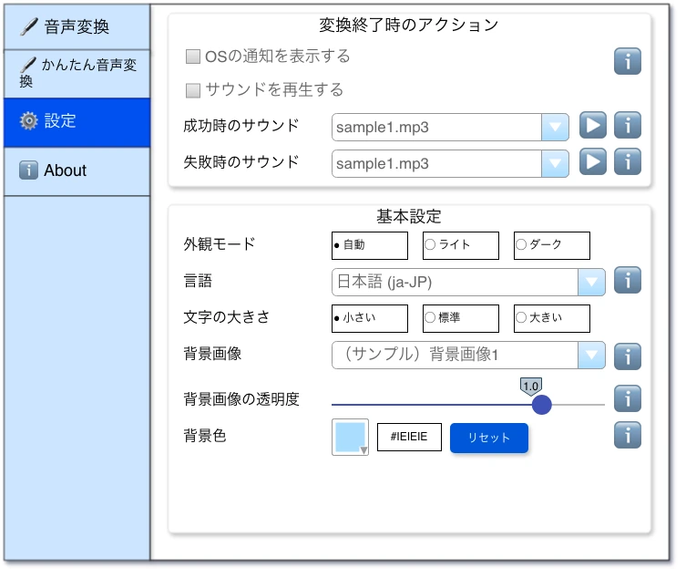

# 設定画面



## ✳️ 変換終了時のアクション

### ✏️ OSの通知を表示する

#### OSの通知を表示するチェックボックス

- `OSの通知を表示する` というラベルのチェックボックスを表示します。

#### ℹ️

- ホバーするとpopoverに説明が表示される。
- 「OS内蔵の通知を表示します。通知の表示はOS側の権限設定が別途必要になります。」というテキストが記述されていること。

### ✏️ サウンドを再生する

#### サウンドを再生するチェックボックス

- チェックを付けると、 `成功時のサウンド` プルダウンが `enable` になります。
- チェックを外すと、 `成功時のサウンド` プルダウンが `disable` になります。

#### 成功時のサウンドプルダウン

サウンド再生の仕組みは [サウンドの再生](../system.md) を参照。

##### プルダウンの選択肢の表示仕様

| 種別                       | パス                                          |
|----------------------------|-----------------------------------------------|
| 同梱のサウンド             | `assets/sounds/success`                       |
| ユーザーが配置したサウンド | `.config/tree-voice-assistant/sounds/success` |

- 上記をまとめてプルダウンに表示します。
- プルダウン選択肢の表示は特殊で、以下のように上部に同梱サウンドを、その後にユーザーサウンドを表示します。
  ```
  同梱サウンド1.mp3
  同梱サウンド2.mp3
  ユーザーサウンド1.mp3
  ユーザーサウンド2.wav
  ユーザーサウンド3.flac
  ```
- 同梱サウンドもユーザーサウンドもファイル名を照準でソートします。
- 選択肢の項目名は `ファイル名` を表示します。
  - 同梱サウンドの場合だけ、 `（サンプル）xxx.mp3` という形式で、 `（サンプル）` をファイル名のprefixにしてください。
  - ユーザーサウンドの場合は `ファイル名` を表示します。

#### ▶️

- クリックすると `成功時のサウンドプルダウン` で選択したサウンドを再生します。

#### 成功時のサウンド ℹ️

- ホバーするとpopoverに説明が表示される。
- 以下のテキストが記述されていること。
  ```
  .config/tree-voice-assistant/sounds/success 配下に音声ファイルを配置すると、自分が用意したファイルを選択することができます。
  サンプル音声は「効果音ラボ https://soundeffect-lab.info/」を利用しています。
  ```

#### 失敗時のサウンドプルダウン

サウンド再生の仕組みは [サウンドの再生](../system.md) を参照。

##### プルダウンの選択肢の表示仕様

| 種別                       | パス                                        |
|----------------------------|---------------------------------------------|
| 同梱のサウンド             | `assets/sounds/error`                       |
| ユーザーが配置したサウンド | `.config/tree-voice-assistant/sounds/error` |

- 上記をまとめてプルダウンに表示します。
- プルダウン選択肢の表示は特殊で、以下のように上部に同梱サウンドを、その後にユーザーサウンドを表示します。
  ```
  同梱サウンド1.mp3
  同梱サウンド2.mp3
  ユーザーサウンド1.mp3
  ユーザーサウンド2.wav
  ユーザーサウンド3.flac
  ```
- 同梱サウンドもユーザーサウンドもファイル名を照準でソートします。
- 選択肢の項目名は `ファイル名` を表示します。
    - 同梱サウンドの場合だけ、 `（サンプル）xxx.mp3` という形式で、 `（サンプル）` をファイル名のprefixにしてください。
    - ユーザーサウンドの場合は `ファイル名` を表示します。

#### ▶️

- クリックすると `失敗時のサウンドプルダウン` で選択したサウンドを再生します。

#### 失敗時のサウンド ℹ️

- ホバーするとpopoverに説明が表示される。
- 以下のテキストが記述されていること。
  ```
  .config/tree-voice-assistant/sounds/error 配下に音声ファイルを配置すると、自分が用意したファイルを選択することができます。
  サンプル音声は「効果音ラボ https://soundeffect-lab.info/」を利用しています。
  ```

## ✳️ 基本設定

### ✏️ 外観モード

#### 静的ラベル

- `外観モード` という静的ラベルを表示します。

#### 外観モードラジオボタン

- macOSの `外観モード` と同じ機能を実装してください。
- ラジオボタンは枠で囲みます。
- ラベルの左にアイコンを表示します。
- 選択肢は以下の通りです。
  - `自動`
  - `ライト`
  - `ダーク`
- 初期値は `自動` です。

### ✏️ 言語選択

#### 静的ラベル

- `言語` という静的ラベルを表示します。

#### 言語選択プルダウン

- 言語（BCP 47）を選択します。
- 選択肢は以下の通り
  - 日本語 (ja-JP)
  - 英語 (en-US)
- `~/.config/tree-voice-assistant/settings.json` で選択画面セクションに選択した言語情報を保存し、次回起動時に復元します。
- `~/.config/tree-voice-assistant/settings.json` に言語設定が無い場合、利用者の環境のロケールからどの言語かを選択します。選択肢に無い言語の場合、英語を選択します。

#### ℹ️
- ホバーするとpopoverに説明が表示される。
- 「出力先に既に同一のファイル名が存在する場合、上書きコピーされます。」というテキストが記述されていること。

### ✏️ 文字の大きさ

#### 静的ラベル

- `文字の大きさ` という静的ラベルを表示します。

#### 文字の大きさラジオボタン

- ラジオボタンは枠で囲みます。
- ラベルの左にアイコンを表示します。
- 選択肢は以下の通りです。
  - `小さい`
  - `標準`
  - `大きい`
- 初期値は `標準` です。

### ✏️ 背景画像

#### 静的ラベル

- `背景画像` という静的ラベルを表示します。

##### プルダウンの選択肢の表示仕様

| 種別                       | パス                                         |
|----------------------------|----------------------------------------------|
| 同梱の背景画像             | `assets/images/wallpaper/wallpaper[1-3].jpg` |
| ユーザーが配置した背景画像 | `.config/tree-voice-assistant/wallpaper`     |

- 上記をまとめてプルダウンに表示します。
- プルダウン選択肢の表示は特殊で、以下のように上部に同梱サウンドを、その後にユーザーサウンドを表示します。
  ```
  同梱背景画像1.jpg
  同梱背景画像2.jpg
  ユーザー背景画像1.jpg
  ユーザー背景画像2.png
  ```
- 同梱背景画像もユーザー背景画像もファイル名を照準でソートします。
- `背景無し` をプルダウン先頭に表示します。
- 初期値は `背景無し` とします。
- 選択肢の項目名は `ファイル名` を表示します。
  - 同梱背景画像の場合だけ、 `（サンプル）xxx.jpg` という形式で、 `（サンプル）` をファイル名のprefixにしてください。
  - ユーザー背景画像の場合は `ファイル名` を表示します。
- 対応している拡張子は以下です。
  - `.jpg`
  - `.png`
- ユーザー背景画像が `存在しない` または `権限不足で参照できない` 場合、 `同梱背景画像1` にフォールバックします。
- 背景画像はアスペクト比を保ったまま、アプリケーションの中に収まるようように設定してください。

#### ℹ️
- ホバーするとpopoverに説明が表示される。
- 以下のテキストが記述されていること。
  ```
  .config/tree-voice-assistant/wallpaper 配下に背景画像ファイルを配置すると、自分が用意したファイルを選択することができます。
  ```

### ✏️ 背景画像の透明度

#### 静的ラベル

- `背景画像の透明度` という静的ラベルを表示します。

#### 背景画像の透明度スライダー

- 最小 = `0.0` 、 最大 = `1.0` です。
- 初期値は `1.0` です。
- この数値は `Opacity` の値です。

#### ℹ️
- ホバーするとpopoverに説明が表示される。
- 以下のテキストが記述されていること。
  ```
  背景画像の透明度を調節することができます。
  ```

### ✏️ 背景色

#### 静的ラベル

- `背景色` という静的ラベルを表示します。

#### 背景色カラーピッカー

- カラーピッカーで背景色を設定することができます。
- 外観モードが `ライト` の場合、初期値は `#FFFFFF` です。
- 外観モードが `ダーク` の場合、初期値は `#1E1E1E` です。

#### リセットボタン

- クリックすると、背景色を初期値に戻します。

#### 背景色テキストボックス

- 現在の値をテキストボックスに表示します。
- 編集可能で、ユーザーが自由に色を入力できます。
- ユーザーが入力して、Enterキーをクリックするとそれを背景色として利用します。
  - 無効な色を入力してEnterされた場合、テキストボックスの枠を赤色にし、変更前の入力値を復元します。
  - 有効な色を入力してEnterされた場合、テキストボックスの枠を通常に戻します。

#### ℹ️
- ホバーするとpopoverに説明が表示される。
- 以下のテキストが記述されていること。
  ```
  背景画像は縦横比を維持するため、余白できることがあります。その余白部分の色が背景色になります。
  ```
